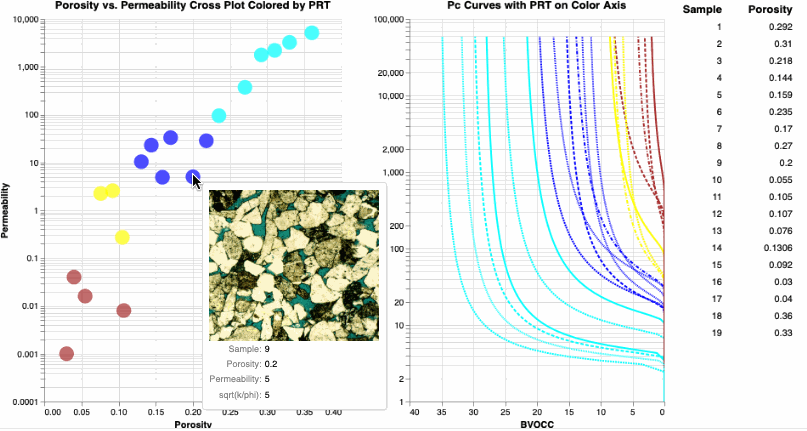
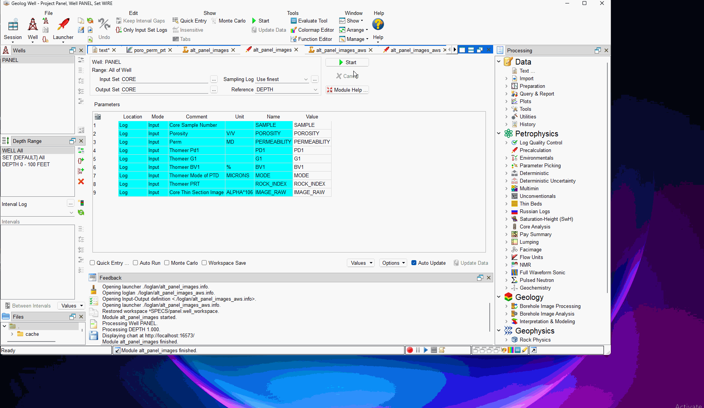

# View-Thin-Section-Images-from-a-Porosity-Permeability-Cross-Plot-using-Python-Altair
We have used some very simple python code to view thin sections from a porosity vs. permeability cross plot using python's Altair and Panel.

>
>### In addition, we have added a Geolog Project with a python loglans to this repository. In one loglan we are accessing the Thin Sections via AWS as url files stored on AWS using Geolog. In the other loglan we render the Thin Section ./plots/.png images directly and then display them with Altair and use Panel to display the select sample text data from the Routine Core Analysis. This new technique overcomes the Thin Section rendering issues associated with Jupyter Lab, .py python files and even rendering these images in Geolog using Altair.
>
>**We have added this new technique to a JupyterLab Notebook for you to try too.** 

Many of us make a living at characterizing reservoirs and yet sometimes we can get separated from the rock itself. Do we truly understand the textural differences in the reservoir? Do we know what is controlling reservoir quality? In the past we have used Spotfire to integrate our Routine Core Analysis (RCA) with the SCAL, but we have found new ways to use python to accomplish the same task. We are using Altair and Vega Panels for our python coding. 

There is an added bonus in that we can also select the samples from the cross plot and a table to the right of the cross plot shows us the RCA data associated with the selected samples. We are searching for a method to actually show the thumbnails of the thin section image in the same table of selected data too. More to come. 

This clastic example is a combination of a few samples where we had porosity, permeability, and thin section photomicrographs. 

The workflow is simple. Our Jupyter Notebook reads in the Excel file as shown below to create a panda DataFrame in python: 

>

and then we produce the following output. To observe the representative Thin Section, we hover over each sample to observe the image of the thin section. If we select data points from the cross plot, then we see the RCA data for the select samples.

>

In this GitHub repository we have placed our image files in a ./data subdirectory to reduce the clutter and better organize our data.

### We have also integrated Capillary Pressure data using the SCAL Thomeer Capillary Pressure parameters to calculate our Pc data:
**You will find these plots at the end of the Jupyter Notebook. You can also observe the thin section from the Pc curves too. This same type of display is also available in our Geolog project too.**

>

### We have added a Geolog project with python Loglans to perform the entire process of interrogating our Routine Core Analysis and Capillary Pressure data viewing the representative Thin Section for each sample as shown below in Geolog. We are now using new Thin Section image rendering code as we used for our new JuptyerLab Notebook. This rendering is native to Jupyter Notebook, so this new code is more universal along all the python platforms including JupyterLab and Geolog. 

>

We can push this a little further. Since each thin section is registered in poro-perm space, then we can use kNN to query our well core calibrated porosity and permeability at each level in our well and assign a representative thin section at each level to create a thin section image log as shown below. 

For this example, we wrote a python loglan in Geolog to perform the kNN process to identify the representative thin sections, and this program will be available in our GitHub site. This program writes out the name of each thin section to be applied at each depth level in the well, and then we used Geolog’s tp_image_from_photo to load each thin section image into an array called photo for display in Geolog. Again, with your robust core datasets from your reservoirs on your wells, this will be more meaningful than this simple example. 

>

The Jupyter Notebook, JupyterLab Notebook and Geolog project can all be downloaded from this GitHub repository.

