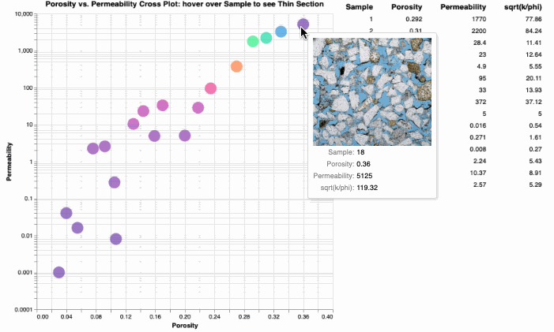

# View-Thin-Section-Images-from-a-Porosity-Permeability-Cross-Plot-using-Python-Altair
We have used some very simple python code to view thin sections from a porosity vs. permeability cross plot using python's Altair and Pane.

Many of us make a living at characterizing reservoirs and yet sometimes we can get separated from the rock itself. Do we truly understand the textural differences in the reservoir? Do we know what is controlling reservoir quality? In the past we have used Spotfire to integrate our Routine Core Analysis (RCA) with the SCAL, but we have found new ways to use python to accomplish the same task. We are using Altair and Vega Panes for our python coding. 

There is an added bonus in that we can also select the samples from the cross plot and a table to the right of the cross plot shows us the RCA data associated with the selected samples. We are searching for a method to actually show the thumbnails of the thin section image in the same table of selected data too. More to come. 

This clastic example is a combination of a few samples where we had porosity, permeability and thin section photomicrographs. The workflow is simple. We read in an Excel file as shown below that links the name of the thin section images file to our RCA data, and then we let python do the rest. 

1) Read an Excel file as shown below to create a pandas DataFrame in python:

2) Launch Jupyter Notebook and run in one go all the cells to obtain the following output:
      - Hover over each sample to observe the image of the thin section.
      - Select data points to see the RCA data for the select samples.

In this GitHub repository we have placed our image files in a ./data subdirectory to reduce the clutter and better organize our data.

# We have also integrated Capillary Pressure data using the SCAL Thomeer Capillary Pressure parameters to calculate our Pc data:
You will find these plots at the end of the Jupyter Notebook.

